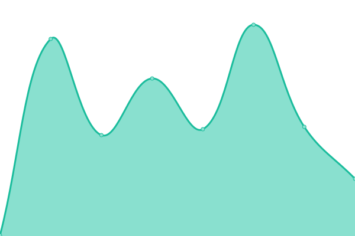

# [📈 Live Status](https://demo.upptime.js.org): <!--live status--> **🟧 Partial outage**

This repository contains the open-source uptime monitor and status page for [LimeNeko](hhnlab.cn), powered by [Upptime](https://github.com/upptime/upptime).

With [Upptime](https://upptime.js.org), you can get your own unlimited and free uptime monitor and status page, powered entirely by a GitHub repository. We use [Issues](https://github.com/Fudujilm/upptime/issues) as incident reports, [Actions](https://github.com/Fudujilm/upptime/actions) as uptime monitors, and [Pages](https://demo.upptime.js.org) for the status page.

<!--start: status pages-->
<!-- This summary is generated by Upptime (https://github.com/upptime/upptime) -->
<!-- Do not edit this manually, your changes will be overwritten -->
<!-- prettier-ignore -->
| URL | Status | History | Response Time | Uptime |
| --- | ------ | ------- | ------------- | ------ |
|  [喵之伊甸主页](https://mzyd.work) | 🟩 Up | [.yml](https://github.com/FuDujilm/upptime/commits/HEAD/history/.yml) | 

 1083ms
     
 | 

<a href="https://status.mzyd.work/history/">100.00%</a>
    

|  [喵喵衣柜（皮肤站）](https://skin.mzyd.work) | 🟩 Up | [.yml](https://github.com/FuDujilm/upptime/commits/HEAD/history/.yml) | 

 1083ms
     
 | 

<a href="https://status.mzyd.work/history/">100.00%</a>
    

|  [HHNLAB-HomePage](https://hhnlab.cn) | 🟩 Up | [hhnlab-home-page.yml](https://github.com/FuDujilm/upptime/commits/HEAD/history/hhnlab-home-page.yml) | 

 291ms
     
 | 

<a href="https://status.mzyd.work/history/hhnlab-home-page">100.00%</a>
    

|  [博客](https://blog.mzyd.work) | 🟩 Up | [.yml](https://github.com/FuDujilm/upptime/commits/HEAD/history/.yml) | 

 1083ms
     
 | 

<a href="https://status.mzyd.work/history/">100.00%</a>
    

|  [喵喵伊甸的下载页(IPV6)](http://holab.hhnlab.cn/) | 🟥 Down | [ipv-6.yml](https://github.com/FuDujilm/upptime/commits/HEAD/history/ipv-6.yml) | 

 0ms
     
 | 

<a href="https://status.mzyd.work/history/ipv-6">100.00%</a>
    

<!--end: status pages-->

[**Visit our status website →**](https://demo.upptime.js.org)

## 📄 License

- Powered by: [Upptime](https://github.com/upptime/upptime)
- Code: [MIT](./LICENSE) © [Anand Chowdhary](https://anandchowdhary.com), supported by [Pabio](https://pabio.com)
- Data in the `./history` directory: [Open Database License](https://opendatacommons.org/licenses/odbl/1-0/)
